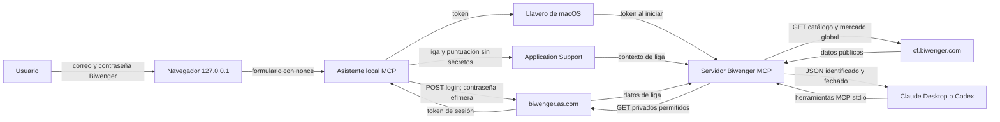

# Arquitectura y flujo de datos

Claude Desktop administra `uv`, crea el entorno Python de la extensión y ejecuta `mcpb_server.py` por `stdio`. No hay un servidor remoto del proyecto. El pequeño servidor HTTP solo existe durante la conexión o desconexión, escucha en loopback y se cierra al completar la operación o caducar.

Las consultas deportivas pasan por una lista cerrada de rutas y métodos. El catálogo público se solicita con el `scoreID` de la liga activa. Cada resultado incluye competición, ID y nombre de puntuación, momento de obtención y advertencias aplicables.
